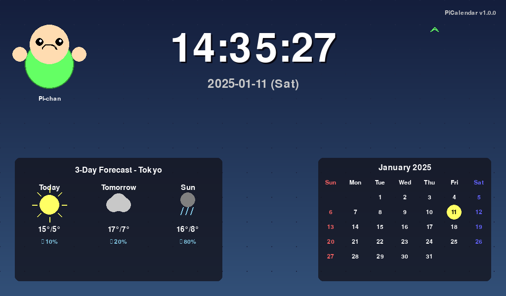

# PiCalendar - Raspberry Pi向け情報表示端末

[](https://www.python.org/downloads/)
[](LICENSE)
[](https://www.raspberrypi.org/)

## 概要

PiCalendarは、Raspberry Pi Zero 2 W向けに設計された常時表示型の情報端末アプリケーションです。デジタル時計、カレンダー、天気予報、2Dキャラクターアニメーションを美しく表示します。



### 主な機能

- 🕐 **デジタル時計** - 大きく見やすいデジタル時計表示
- 📅 **カレンダー** - 当月のカレンダーを日曜始まりで表示
- 🌤️ **天気予報** - 3日分の天気予報を表示（Open-Meteo対応）
- 🎭 **2Dキャラクター** - カスタマイズ可能なアニメーションキャラクター
- 🖼️ **背景画像** - 壁紙のローテーション表示
- ⚡ **軽量動作** - Raspberry Pi Zero 2 Wで快適に動作
- 🔄 **自動起動** - systemdサービスによる自動起動

## 動作環境

### ハードウェア要件
- Raspberry Pi Zero 2 W（推奨）またはそれ以上
- 解像度1024×600のディスプレイ
- microSDカード（8GB以上推奨）
- 安定した電源供給

### ソフトウェア要件
- Raspberry Pi OS Lite (64-bit推奨)
- Python 3.11以上
- pygame 2.0以上
- インターネット接続（天気情報取得用）

## インストール

### 1. システムの準備

```bash
# システムアップデート
sudo apt update && sudo apt upgrade -y

# 必要なパッケージのインストール
sudo apt install -y python3-pip python3-pygame fonts-noto-cjk git
```

### 2. アプリケーションのダウンロード

```bash
# リポジトリのクローン
git clone https://github.com/zabaglione/picalender.git
cd picalender
```

### 3. 依存関係のインストール

#### 方法1: 仮想環境を使用（推奨）

```bash
# 仮想環境の作成
python3 -m venv venv

# 仮想環境の有効化
source venv/bin/activate

# 依存関係のインストール
pip install -r requirements.txt
```

#### 方法2: システムワイドインストール

```bash
# Raspberry Pi OS (Bookworm以降)の場合
pip3 install -r requirements.txt --break-system-packages

# または、aptで個別にインストール
sudo apt install -y python3-pygame python3-yaml python3-requests python3-pillow
```

### 4. 設定

```bash
# 設定ファイルのコピー（初回のみ）
cp settings.example.yaml settings.yaml

# 設定の編集
nano settings.yaml
```

主な設定項目：
- `weather.location` - 天気情報を取得する地点の座標
- `screen.fullscreen` - フルスクリーン表示の有効/無効
- `character.enabled` - キャラクター表示の有効/無効

### 5. 自動起動の設定

```bash
# インストールスクリプトの実行
sudo ./scripts/install_service.sh

# サービスの有効化
sudo systemctl enable picalender
sudo systemctl start picalender
```

## 使用方法

### 手動起動

```bash
# 仮想環境を使用している場合
source venv/bin/activate
python main.py

# システムワイドインストールの場合
python3 main.py

# デバッグモードで起動
python3 main.py --debug
```

### サービス管理

```bash
# サービスの状態確認
sudo systemctl status picalender

# サービスの停止
sudo systemctl stop picalender

# サービスの再起動
sudo systemctl restart picalender

# ログの確認
sudo journalctl -u picalender -f
```

## 設定ファイル

`settings.yaml`で様々な設定をカスタマイズできます：

```yaml
# 画面設定
screen:
  width: 1024
  height: 600
  fps: 30
  fullscreen: true

# UI設定
ui:
  margins: { x: 24, y: 16 }
  clock_font_px: 130
  date_font_px: 36
  calendar_font_px: 22
  weather_font_px: 22

# 天気設定
weather:
  provider: openmeteo
  location: 
    latitude: 35.681236
    longitude: 139.767125
  refresh_sec: 1800

# キャラクター設定
character:
  enabled: true
  sprite: ./assets/sprites/char_idle.png
  frame_w: 128
  frame_h: 128
  fps: 8

# 背景設定
background:
  directory: ./wallpapers
  mode: fit
  rescan_sec: 300
```

## カスタマイズ

### 壁紙の追加

`wallpapers/`ディレクトリに画像ファイルを追加すると自動的に認識されます：

```bash
# JPG/PNG形式の画像を追加
cp your_image.jpg wallpapers/
```

### キャラクターの変更

1. スプライトシート画像を`assets/sprites/`に配置
2. `settings.yaml`の`character.sprite`パスを更新
3. フレームサイズを調整

### フォントの変更

1. TrueTypeフォントを`assets/fonts/`に配置
2. `settings.yaml`の`fonts.main`パスを更新

## トラブルシューティング

### 画面が表示されない

```bash
# ディスプレイドライバの確認
ls /dev/fb*

# KMSドライバの有効化
echo "dtoverlay=vc4-kms-v3d" | sudo tee -a /boot/config.txt
sudo reboot
```

### 天気が取得できない

```bash
# ネットワーク接続の確認
ping -c 4 api.open-meteo.com

# DNS設定の確認
cat /etc/resolv.conf
```

### パフォーマンスが低い

設定ファイルで品質レベルを調整：

```yaml
performance:
  default_quality: low  # ultra_low, low, medium, high
  auto_adjust: true
```

### ログの確認

```bash
# システムログ
sudo journalctl -u picalender --since today

# アプリケーションログ
tail -f logs/picalender.log
```

## 開発

### テストの実行

```bash
# 全テストの実行
make test

# 単体テストのみ
make test-unit

# 統合テストのみ
make test-integration

# カバレッジレポート
make coverage
```

### コード品質チェック

```bash
# リンター実行
make lint

# フォーマット
make format

# タイプチェック
make typecheck
```

### ベンチマーク

```bash
# パフォーマンステスト
make benchmark
```

## パフォーマンス最適化

### 推奨設定（Raspberry Pi Zero 2 W）

```yaml
performance:
  default_quality: low
  auto_adjust: true
  
screen:
  fps: 15
  
weather:
  refresh_sec: 3600  # 1時間ごと
  
background:
  rescan_sec: 600    # 10分ごと
```

### メモリ使用量の削減

- キャラクターアニメーションを無効化
- 背景画像のサイズを最適化（1024×600）
- キャッシュサイズを制限

## ライセンス

このプロジェクトはMITライセンスの下で公開されています。詳細は[LICENSE](LICENSE)ファイルを参照してください。

## クレジット

- **天気データ**: [Open-Meteo](https://open-meteo.com/) - 無料の天気予報API
- **フォント**: [Noto Sans CJK](https://github.com/googlefonts/noto-cjk) - Google Fonts
- **アイコン**: Weather Icons - 天気アイコンセット

## 貢献

プルリクエストを歓迎します！大きな変更の場合は、まずissueを開いて変更内容について議論してください。

1. プロジェクトをフォーク
2. フィーチャーブランチを作成 (`git checkout -b feature/AmazingFeature`)
3. 変更をコミット (`git commit -m 'Add some AmazingFeature'`)
4. ブランチにプッシュ (`git push origin feature/AmazingFeature`)
5. プルリクエストを開く

## サポート

問題が発生した場合は、[Issues](https://github.com/zabaglione/picalender/issues)でお知らせください。

## 作者

- zabaglione - [@z_zabaglione](https://twitter.com/z_zabaglione)

## 謝辞

- Raspberry Pi Foundationの素晴らしいハードウェア
- オープンソースコミュニティの皆様
- このプロジェクトに貢献してくださったすべての方々