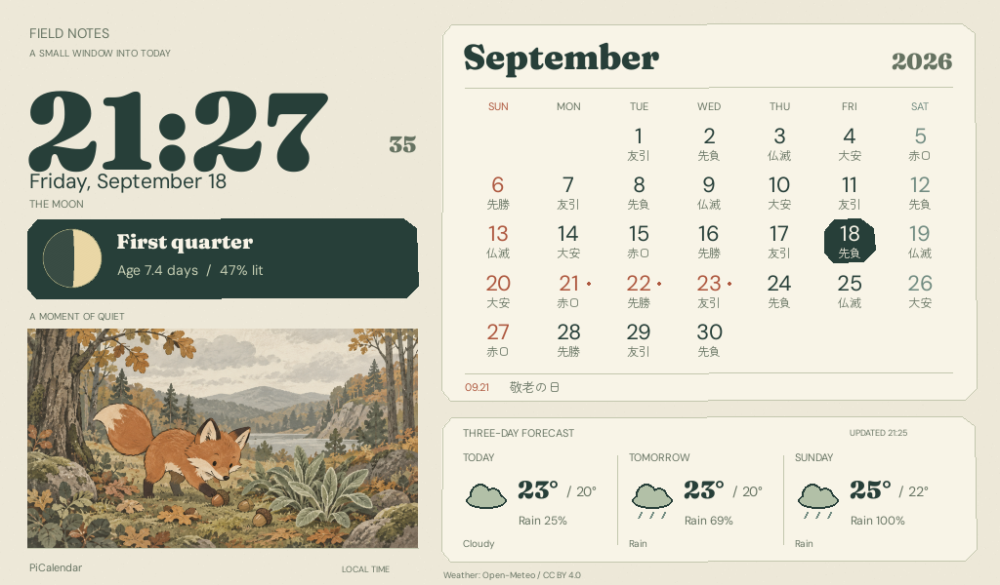

# PiCalendar - Raspberry Pi向け情報表示端末

Raspberry Pi Zero 2 Wと1024×600の画面向けの常時表示アプリです。時計、カレンダー、祝日、六曜、月齢、天文時刻、3日分の天気予報を表示します。

標準の **Field Notes** は12か月の手描き・和紙調背景を自動で切り替えます。2026-10-01に背景と日替わり画像の生成入力を更新しました。実装と検証範囲は[月替わりテーマ](docs/monthly-wafu-themes.md)を参照してください。



## 機能

- 時計、日付、日曜／月曜始まりの当月カレンダー、日本の祝日、旧暦に基づく六曜。
- 実際の新月から求める月齢、照明率に応じた月の形、英日併記の月相名。新月・上弦・満月・下弦の名称はJSTの現象日に表示。
- 設定地点の日の出・日の入・月の出・月の入、次の月相と祝日。
- Open-Meteoの3日予報、取得日時、欠測・古い予報の区別。通信失敗時は取得済みデータを保持。
- 12か月の背景は同梱PNGを使用し、ネット接続なしで切り替え。
- 任意の日替わり画像は別サーバーのCodexで生成。記念日・季節・祝日・有効な予報を入力し、取得失敗時は前の画像を保持。[設定手順](docs/guides/DAILY_ARTWORK.md)
- KMSDRM／X11／macOSの環境検出、systemdによる自動起動。

旧画面は `ui.style: classic` で使用できます。旧画面の壁紙やフォント設定は、標準画面には適用されません。キャラクター・高度な設定管理のモジュールは残っていますが、現在の `main.py` には接続されていません。

## セットアップ

Python 3.11以上、pygame 2.5以上と `requirements.txt` の依存関係を使用します。天気取得にはネット接続が必要ですが、暦・月・背景の表示はオフラインで動作します。

Raspberry Pi OSで、通常ユーザーのホームへ導入します。

```bash
sudo apt update
sudo apt install -y python3-pip python3-venv python3-pygame fonts-noto-cjk git
git clone https://github.com/zabaglione/picalender.git ~/picalender
cd ~/picalender
python3 -m venv venv
venv/bin/python -m pip install -r requirements.txt
cp settings.example.yaml settings.yaml
nano settings.yaml
```

`cp` は初回のみ実行してください。既存の設定は保持します。pygameの導入・表示環境の詳細は[インストールガイド](docs/guides/INSTALL_GUIDE.md)を参照してください。

```yaml
ui:
  style: field_notes
screen:
  width: 1024
  height: 600
  fps: 5
  fullscreen: true
weather:
  timezone: Asia/Tokyo
  location:
    lat: 35.681236
    lon: 139.767125
  refresh_sec: 1800
calendar:
  first_weekday: SUNDAY
  holidays_enabled: true
  show_holiday_names: true
  rokuyou_enabled: true
  show_rokuyou_names: true
  moon_phase_enabled: true
```

座標は利用地点に変更してください。Field Notesは1024×600基準の固定配置で、別寸法では縦横比を保って全体を拡縮します。別寸法の実機確認は今回行っていません。[設定項目の対応表](docs/guides/SETTINGS_STATUS.md)で画面ごとの差を確認できます。

## 起動・運用

手動起動はデスクトップ／表示可能な端末で実行します。

```bash
cd ~/picalender
venv/bin/python main.py
# 開発用ウィンドウ表示
PICALENDER_WINDOWED=true venv/bin/python main.py
```

Piでサービスを導入する場合：

```bash
sudo ./scripts/install_service.sh
systemctl cat picalender
```

現在の同梱テンプレートにはユーザーとホームパスの固定値が残り、インストーラーの置換対象と一致していません。開始前に `User`、`Group`、`WorkingDirectory`、`ExecStart`、`PYTHONPATH` が自身の環境を指すことを確認し、異なる場合は `sudo systemctl edit --full picalender` で修正して `sudo systemctl daemon-reload` を実行してください。

```bash
sudo systemctl enable --now picalender
sudo systemctl status picalender --no-pager
sudo systemctl restart picalender
sudo journalctl -u picalender --since today
```

サービス運用時の再起動には `systemctl` を使用します。[接続・更新・復旧](docs/guides/UPDATE_GUIDE.md)にバックアップ付き転送、ロールバック、画面取得の手順があります。

## 開発・確認

リポジトリにMakefileはありません。現在のダッシュボードに関するテスト：

```bash
SDL_VIDEODRIVER=dummy SDL_AUDIODRIVER=dummy venv/bin/python -m pytest -q \
  tests/test_astronomy_accuracy.py tests/test_dashboard_weather.py \
  tests/test_monthly_theme.py tests/test_daily_art.py tests/test_staged_update.py
venv/bin/python scripts/render_preview.py --offline --all-months \
  --output output/monthly/preview.png
```

全体の既存テストは `venv/bin/python -m pytest tests` で実行できます。過去の設計向けテストを含むため、全件成功や現行画面の実機受け入れを意味しません。対象テスト、プレビュー、Pi上の稼働画面、物理パネルの確認は区別して記録します。

## ドキュメント

- [文書一覧と現行／過去資料の区分](docs/README.md)
- [設定ガイド](docs/guides/SETTINGS_GUIDE.md)、[機能一覧](docs/guides/FEATURES.md)
- [月替わりテーマ](docs/monthly-wafu-themes.md)、[日替わりイラスト](docs/guides/DAILY_ARTWORK.md)
- [運用マニュアル](docs/OPERATION_MANUAL.md)、[実装API](docs/API_DOCUMENTATION.md)
- [2026-10-01の文書・Issues監査](docs/documentation-audit-2026-10-01.md)

## ライセンス・クレジット

[MITライセンス](LICENSE)。天気はOpen-Meteo、暦・天文計算はAstronomy Engineとholidaysを使用します。Field NotesのフォントはDM Sans、Fraunces、Zen Maru Gothicで、利用条件は `assets/field_notes/` の各OFLファイルに収録しています。背景画像の制作情報は[アセットREADME](assets/field_notes/monthly/README.md)にあります。

不具合や改善案は[GitHub Issues](https://github.com/zabaglione/picalender/issues)へ。
