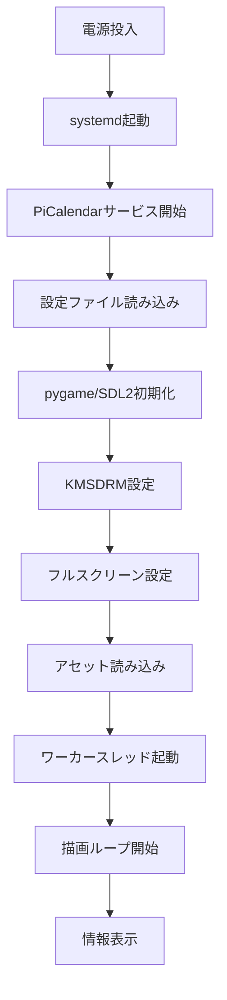
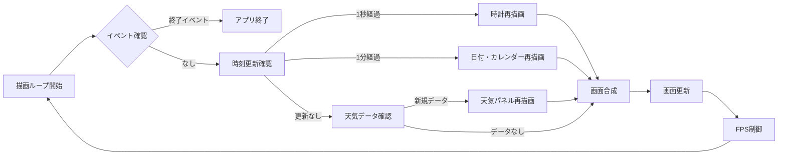
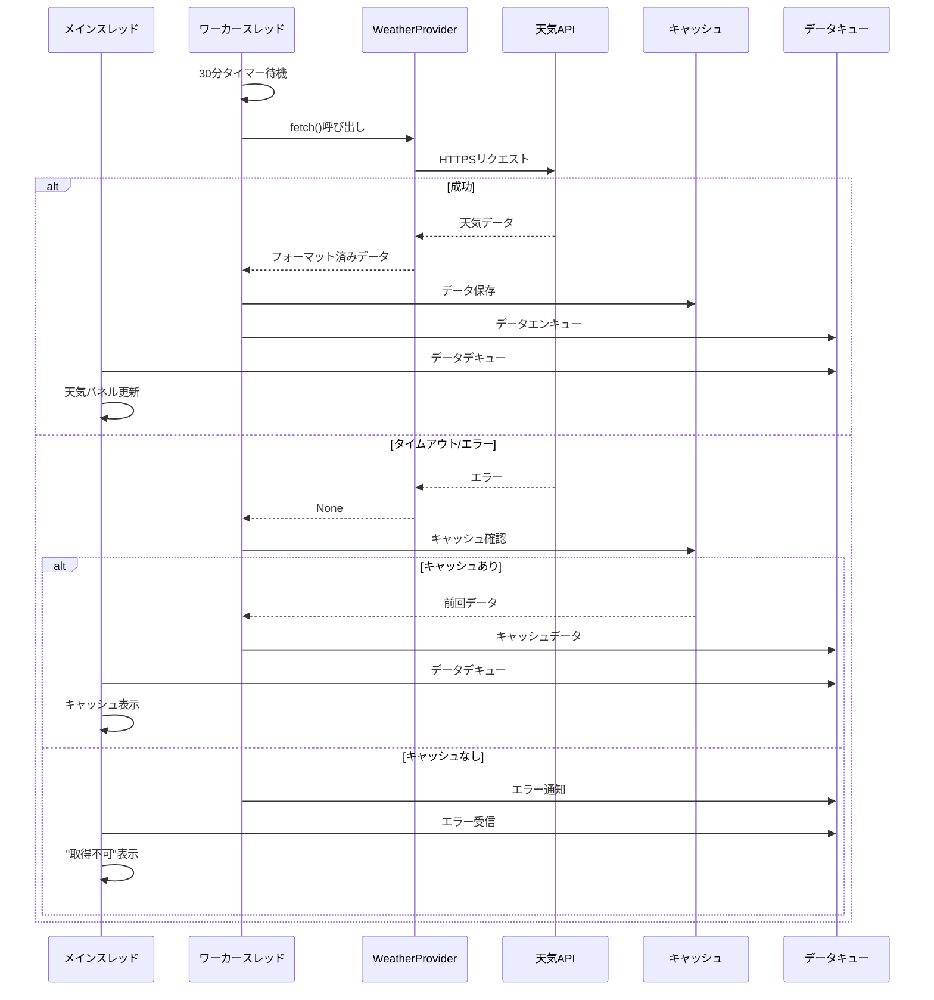
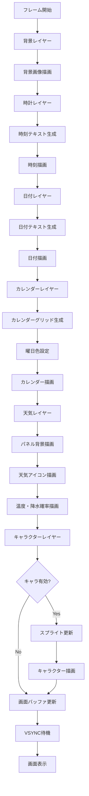
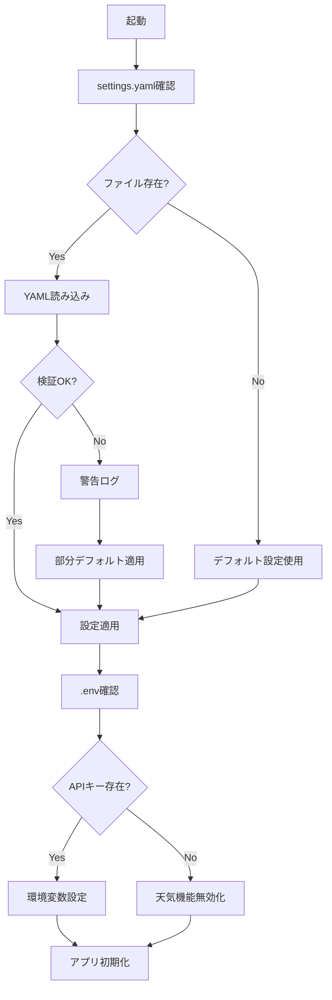
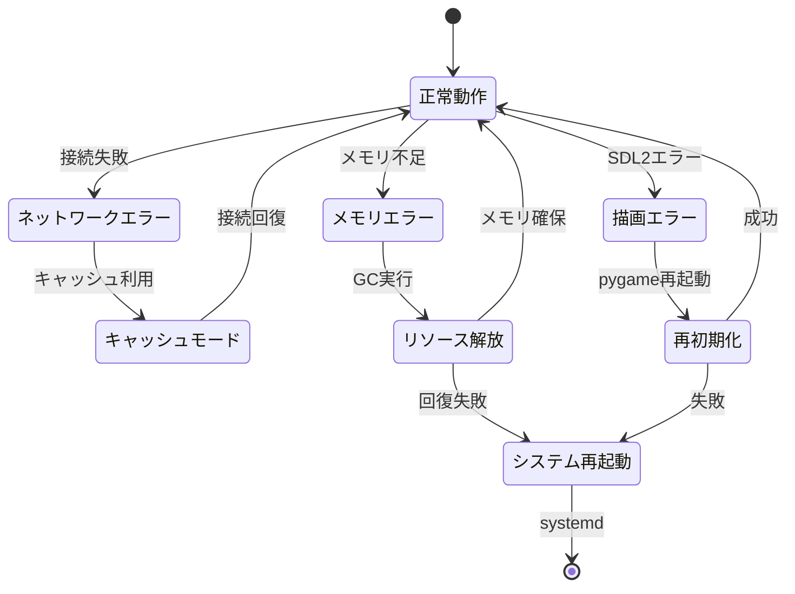
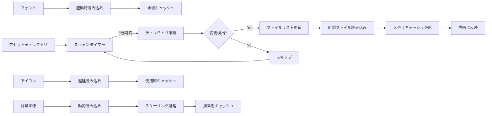
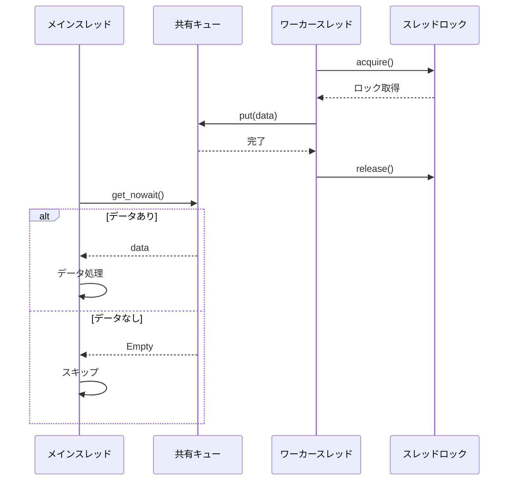
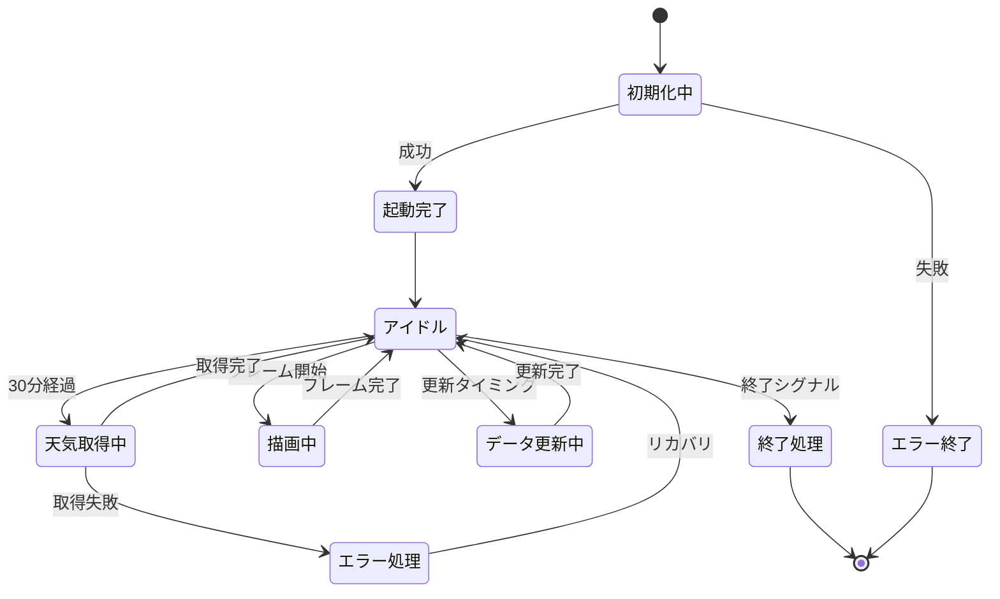
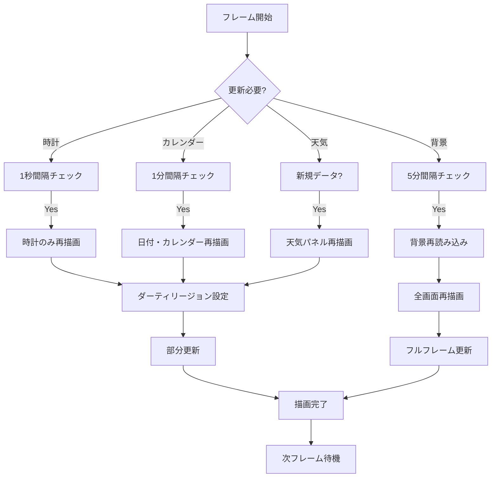

# PiCalendar データフロー図

## システム起動フロー

```mermaid
flowchart TD
    A[電源投入] --> B[systemd起動]
    B --> C[PiCalendarサービス開始]
    C --> D[設定ファイル読み込み]
    D --> E[pygame/SDL2初期化]
    E --> F[KMSDRM設定]
    F --> G[フルスクリーン設定]
    G --> H[アセット読み込み]
    H --> I[ワーカースレッド起動]
    I --> J[描画ループ開始]
    J --> K[情報表示]
```

## メインループ処理フロー

```mermaid
flowchart LR
    A[描画ループ開始] --> B{イベント確認}
    B -->|終了イベント| C[アプリ終了]
    B -->|なし| D[時刻更新確認]
    D -->|1秒経過| E[時計再描画]
    D -->|1分経過| F[日付・カレンダー再描画]
    D -->|更新なし| G[天気データ確認]
    G -->|新規データ| H[天気パネル再描画]
    G -->|データなし| I[画面合成]
    E --> I
    F --> I
    H --> I
    I --> J[画面更新]
    J --> K[FPS制御]
    K --> A
```

## 天気情報取得フロー

```mermaid
sequenceDiagram
    participant MT as メインスレッド
    participant WT as ワーカースレッド
    participant WP as WeatherProvider
    participant API as 天気API
    participant Cache as キャッシュ
    participant Queue as データキュー

    WT->>WT: 30分タイマー待機
    WT->>WP: fetch()呼び出し
    WP->>API: HTTPSリクエスト
    alt 成功
        API-->>WP: 天気データ
        WP-->>WT: フォーマット済みデータ
        WT->>Cache: データ保存
        WT->>Queue: データエンキュー
        MT->>Queue: データデキュー
        MT->>MT: 天気パネル更新
    else タイムアウト/エラー
        API-->>WP: エラー
        WP-->>WT: None
        WT->>Cache: キャッシュ確認
        alt キャッシュあり
            Cache-->>WT: 前回データ
            WT->>Queue: キャッシュデータ
            MT->>Queue: データデキュー
            MT->>MT: キャッシュ表示
        else キャッシュなし
            WT->>Queue: エラー通知
            MT->>Queue: エラー受信
            MT->>MT: "取得不可"表示
        end
    end
```

## レンダリングパイプライン

```mermaid
flowchart TD
    A[フレーム開始] --> B[背景レイヤー]
    B --> B1[背景画像描画]
    B1 --> C[時計レイヤー]
    C --> C1[時刻テキスト生成]
    C1 --> C2[時刻描画]
    C2 --> D[日付レイヤー]
    D --> D1[日付テキスト生成]
    D1 --> D2[日付描画]
    D2 --> E[カレンダーレイヤー]
    E --> E1[カレンダーグリッド生成]
    E1 --> E2[曜日色設定]
    E2 --> E3[カレンダー描画]
    E3 --> F[天気レイヤー]
    F --> F1[パネル背景描画]
    F1 --> F2[天気アイコン描画]
    F2 --> F3[温度・降水確率描画]
    F3 --> G[キャラクターレイヤー]
    G --> G1{キャラ有効?}
    G1 -->|Yes| G2[スプライト更新]
    G2 --> G3[キャラクター描画]
    G1 -->|No| H[画面バッファ更新]
    G3 --> H
    H --> I[VSYNC待機]
    I --> J[画面表示]
```

## 設定管理フロー

```mermaid
flowchart TD
    A[起動] --> B[settings.yaml確認]
    B --> C{ファイル存在?}
    C -->|Yes| D[YAML読み込み]
    C -->|No| E[デフォルト設定使用]
    D --> F{検証OK?}
    F -->|Yes| G[設定適用]
    F -->|No| H[警告ログ]
    H --> I[部分デフォルト適用]
    E --> G
    I --> G
    G --> J[.env確認]
    J --> K{APIキー存在?}
    K -->|Yes| L[環境変数設定]
    K -->|No| M[天気機能無効化]
    L --> N[アプリ初期化]
    M --> N
```

## エラーリカバリフロー

```mermaid
stateDiagram-v2
    [*] --> 正常動作
    正常動作 --> ネットワークエラー: 接続失敗
    正常動作 --> メモリエラー: メモリ不足
    正常動作 --> 描画エラー: SDL2エラー
    
    ネットワークエラー --> キャッシュモード: キャッシュ利用
    キャッシュモード --> 正常動作: 接続回復
    
    メモリエラー --> リソース解放: GC実行
    リソース解放 --> 正常動作: メモリ確保
    リソース解放 --> システム再起動: 回復失敗
    
    描画エラー --> 再初期化: pygame再起動
    再初期化 --> 正常動作: 成功
    再初期化 --> システム再起動: 失敗
    
    システム再起動 --> [*]: systemd
```

## アセット管理フロー

```mermaid
flowchart LR
    A[アセットディレクトリ] --> B[スキャンタイマー]
    B -->|5分間隔| C[ディレクトリ確認]
    C --> D{変更検出?}
    D -->|Yes| E[ファイルリスト更新]
    E --> F[新規ファイル読み込み]
    F --> G[メモリキャッシュ更新]
    D -->|No| H[スキップ]
    G --> I[描画に反映]
    H --> B
    
    J[フォント] --> K[起動時読み込み]
    K --> L[永続キャッシュ]
    
    M[アイコン] --> N[遅延読み込み]
    N --> O[使用時キャッシュ]
    
    P[背景画像] --> Q[動的読み込み]
    Q --> R[スケーリング処理]
    R --> S[描画用キャッシュ]
```

## スレッド間通信

```mermaid
sequenceDiagram
    participant Main as メインスレッド
    participant Queue as 共有キュー
    participant Worker as ワーカースレッド
    participant Lock as スレッドロック

    Worker->>Lock: acquire()
    Lock-->>Worker: ロック取得
    Worker->>Queue: put(data)
    Queue-->>Worker: 完了
    Worker->>Lock: release()
    
    Main->>Queue: get_nowait()
    alt データあり
        Queue-->>Main: data
        Main->>Main: データ処理
    else データなし
        Queue-->>Main: Empty
        Main->>Main: スキップ
    end
```

## システム状態遷移

```mermaid
stateDiagram-v2
    [*] --> 初期化中
    初期化中 --> 起動完了: 成功
    初期化中 --> エラー終了: 失敗
    
    起動完了 --> アイドル
    アイドル --> 描画中: フレーム開始
    描画中 --> アイドル: フレーム完了
    
    アイドル --> データ更新中: 更新タイミング
    データ更新中 --> アイドル: 更新完了
    
    アイドル --> 天気取得中: 30分経過
    天気取得中 --> アイドル: 取得完了
    天気取得中 --> エラー処理: 取得失敗
    エラー処理 --> アイドル: リカバリ
    
    アイドル --> 終了処理: 終了シグナル
    終了処理 --> [*]
    
    エラー終了 --> [*]
```

## パフォーマンス最適化フロー

```mermaid
flowchart TD
    A[フレーム開始] --> B{更新必要?}
    B -->|時計| C[1秒間隔チェック]
    C -->|Yes| D[時計のみ再描画]
    B -->|カレンダー| E[1分間隔チェック]
    E -->|Yes| F[日付・カレンダー再描画]
    B -->|天気| G[新規データ?]
    G -->|Yes| H[天気パネル再描画]
    B -->|背景| I[5分間隔チェック]
    I -->|Yes| J[背景再読み込み]
    
    D --> K[ダーティリージョン設定]
    F --> K
    H --> K
    J --> L[全画面再描画]
    
    K --> M[部分更新]
    L --> N[フルフレーム更新]
    M --> O[描画完了]
    N --> O
    
    O --> P[次フレーム待機]
```