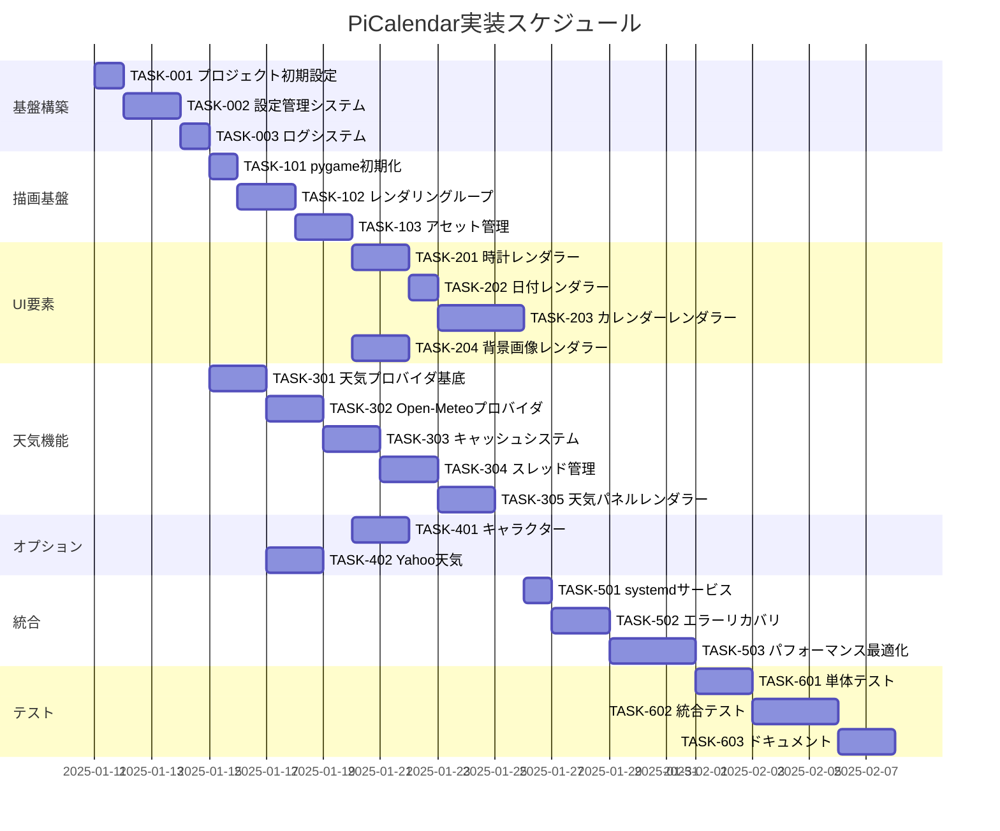

# PiCalendar 実装タスク

## 概要

全タスク数: 35
推定作業時間: 80時間
クリティカルパス: TASK-001 → TASK-002 → TASK-003 → TASK-101 → TASK-102 → TASK-201 → TASK-301

## タスク一覧

### フェーズ1: 基盤構築

#### TASK-001: プロジェクト初期設定

- [x] **タスク完了**
- **タスクタイプ**: DIRECT
- **要件リンク**: REQ-009, REQ-401
- **依存タスク**: なし
- **実装詳細**:
  - プロジェクトディレクトリ構造作成
  - Pythonパッケージ構成
  - requirements.txt作成
  - .gitignore設定
- **テスト要件**:
  - [x] Python 3.11以上の動作確認
  - [x] 必要パッケージのインストール確認
- **完了条件**:
  - [x] ディレクトリ構造が仕様通り作成されている
  - [x] pip install -r requirements.txtが成功する

#### TASK-002: 設定管理システム実装

- [x] **タスク完了**
- **タスクタイプ**: TDD
- **要件リンク**: REQ-009, NFR-205, NFR-304
- **依存タスク**: TASK-001
- **実装詳細**:
  - YAMLパーサー実装
  - 設定ファイル読み込み機能
  - デフォルト値管理
  - 環境変数オーバーライド
  - 設定バリデーション
- **テスト要件**:
  - [ ] 単体テスト: YAML読み込み
  - [ ] 単体テスト: デフォルト値適用
  - [ ] 単体テスト: バリデーション
  - [ ] 統合テスト: 不正な設定ファイル処理
- **エラーハンドリング**:
  - [ ] ファイル不在時のデフォルト動作
  - [ ] 不正なYAML形式の処理
  - [ ] 型不整合の検出と警告

#### TASK-003: ログシステム実装

- [x] **タスク完了**
- **タスクタイプ**: TDD
- **要件リンク**: REQ-009, NFR-402, NFR-403
- **依存タスク**: TASK-002
- **実装詳細**:
  - ログフォーマッター設定
  - レベル別ログ出力
  - journald連携
  - ファイル出力オプション
  - モジュール別ログ制御
- **テスト要件**:
  - [ ] 単体テスト: ログレベル制御
  - [ ] 単体テスト: フォーマット検証
  - [ ] 統合テスト: journald出力確認
- **完了条件**:
  - [ ] INFO/ERROR/DEBUGレベルの出力確認
  - [ ] タイムスタンプ付きログ出力

### フェーズ2: 描画基盤

#### TASK-101: pygame/SDL2初期化

- [ ] **タスク完了**
- **タスクタイプ**: TDD
- **要件リンク**: REQ-005, REQ-007, REQ-402
- **依存タスク**: TASK-003
- **実装詳細**:
  - pygame初期化
  - KMSDRM設定
  - フルスクリーン設定
  - マウスカーソル非表示
  - FPS制御
- **テスト要件**:
  - [ ] 単体テスト: 初期化成功確認
  - [ ] 統合テスト: 1024x600解像度確認
  - [ ] 統合テスト: フルスクリーン動作確認
- **エラーハンドリング**:
  - [ ] SDL初期化失敗時の処理
  - [ ] ディスプレイ未接続時の処理
- **完了条件**:
  - [ ] 黒画面でフルスクリーン表示
  - [ ] マウスカーソル非表示確認

#### TASK-102: レンダリングループ実装

- [ ] **タスク完了**
- **タスクタイプ**: TDD
- **要件リンク**: NFR-001, NFR-002, REQ-404
- **依存タスク**: TASK-101
- **実装詳細**:
  - メインループ構造
  - FPS制御（30fps）
  - イベント処理
  - ダーティリージョン管理
  - レイヤー合成
- **テスト要件**:
  - [ ] パフォーマンステスト: CPU使用率30%未満
  - [ ] パフォーマンステスト: メモリ使用量180MB以下
  - [ ] 単体テスト: FPS維持確認
- **完了条件**:
  - [ ] 安定した30FPS動作
  - [ ] CPU/メモリ使用量が仕様内

#### TASK-103: アセット管理システム

- [ ] **タスク完了**
- **タスクタイプ**: TDD
- **要件リンク**: NFR-404, REQ-410
- **依存タスク**: TASK-102
- **実装詳細**:
  - フォントローダー
  - 画像ローダー
  - スプライトシートローダー
  - キャッシュ管理
  - 動的リロード機能
- **テスト要件**:
  - [ ] 単体テスト: フォント読み込み
  - [ ] 単体テスト: 画像読み込み
  - [ ] エラーテスト: ファイル不在処理
- **エラーハンドリング**:
  - [ ] フォント読み込み失敗時のフォールバック
  - [ ] 画像読み込み失敗時のデフォルト表示

### フェーズ3: UI要素実装

#### TASK-201: 時計レンダラー実装

- [ ] **タスク完了**
- **タスクタイプ**: TDD
- **要件リンク**: REQ-001, NFR-201, REQ-408
- **依存タスク**: TASK-103
- **実装詳細**:
  - 時刻取得と整形
  - テキストレンダリング
  - 位置計算（中央上部）
  - 毎秒更新処理
  - フォントサイズ130px
- **テスト要件**:
  - [ ] 単体テスト: 時刻フォーマット検証
  - [ ] 統合テスト: 1秒ごとの更新確認
  - [ ] 精度テスト: ±1秒以内の遅延
- **UI/UX要件**:
  - [ ] 大きく読みやすいフォント表示
  - [ ] 滑らかな秒針更新
  - [ ] 中央配置の確認
- **完了条件**:
  - [ ] 時:分:秒が正しく表示される
  - [ ] 毎秒更新される

#### TASK-202: 日付レンダラー実装

- [ ] **タスク完了**
- **タスクタイプ**: TDD
- **要件リンク**: REQ-002, NFR-201
- **依存タスク**: TASK-201
- **実装詳細**:
  - 日付取得と整形（YYYY-MM-DD 曜日）
  - テキストレンダリング
  - 時計直下配置
  - 毎分更新処理
  - フォントサイズ36px
- **テスト要件**:
  - [ ] 単体テスト: 日付フォーマット検証
  - [ ] 単体テスト: 曜日表示検証
  - [ ] 統合テスト: 日付変更時の更新確認
- **UI/UX要件**:
  - [ ] 時計との視覚的バランス
  - [ ] 曜日の日本語/英語切り替え対応
- **完了条件**:
  - [ ] 正しい日付と曜日が表示される
  - [ ] 毎分更新される

#### TASK-203: カレンダーレンダラー実装

- [ ] **タスク完了**
- **タスクタイプ**: TDD
- **要件リンク**: REQ-003, REQ-104, REQ-105, REQ-106, NFR-202
- **依存タスク**: TASK-202
- **実装詳細**:
  - カレンダーグリッド生成（7×6）
  - 日曜始まり配置
  - 曜日別色分け（日曜:赤、土曜:青、平日:白）
  - 今日の日付ハイライト
  - 月替わり自動更新
- **テスト要件**:
  - [ ] 単体テスト: カレンダー生成ロジック
  - [ ] 単体テスト: 曜日色分け検証
  - [ ] 境界値テスト: 月末月初の処理
  - [ ] 統合テスト: 月替わり時の更新
- **UI/UX要件**:
  - [ ] 420×280pxサイズ内に収まる
  - [ ] 右下配置の確認
  - [ ] グリッド線の表示
  - [ ] 今日の日付の視覚的強調
- **完了条件**:
  - [ ] 正しいカレンダーが表示される
  - [ ] 曜日ごとの色分けが適用される
  - [ ] 月が変わると自動更新される

#### TASK-204: 背景画像レンダラー実装

- [ ] **タスク完了**
- **タスクタイプ**: TDD
- **要件リンク**: REQ-008, REQ-109, NFR-005
- **依存タスク**: TASK-103
- **実装詳細**:
  - 画像読み込みとスケーリング
  - fit/scaleモード実装
  - ディレクトリスキャン機能
  - 定期的な再スキャン（300秒）
  - レターボックス処理
- **テスト要件**:
  - [ ] 単体テスト: 画像スケーリング
  - [ ] 単体テスト: fitモード検証
  - [ ] 統合テスト: ディレクトリスキャン
  - [ ] エラーテスト: 画像不在時の処理
- **エラーハンドリング**:
  - [ ] 画像ファイル不在時の黒背景表示
  - [ ] 破損画像の処理
- **完了条件**:
  - [ ] 背景画像が正しく表示される
  - [ ] アスペクト比が保持される

### フェーズ4: 天気機能実装

#### TASK-301: 天気プロバイダ基底クラス実装

- [ ] **タスク完了**
- **タスクタイプ**: TDD
- **要件リンク**: NFR-401, REQ-407
- **依存タスク**: TASK-003
- **実装詳細**:
  - 抽象基底クラス定義
  - 共通インターフェース実装
  - HTTPSクライアント設定
  - タイムアウト処理
  - アイコンマッピング基本実装
- **テスト要件**:
  - [ ] 単体テスト: インターフェース検証
  - [ ] セキュリティテスト: HTTPS通信確認
  - [ ] タイムアウトテスト: 10秒制限
- **完了条件**:
  - [ ] 抽象クラスが定義される
  - [ ] HTTPS通信が可能

#### TASK-302: Open-Meteoプロバイダ実装

- [ ] **タスク完了**
- **タスクタイプ**: TDD
- **要件リンク**: REQ-004, REQ-101, NFR-004
- **依存タスク**: TASK-301
- **実装詳細**:
  - Open-Meteo API連携
  - レスポンスパース処理
  - 天気コードからアイコンへのマッピング
  - 3日分のデータ取得
  - エラーハンドリング
- **テスト要件**:
  - [ ] 単体テスト: APIレスポンスパース
  - [ ] 単体テスト: アイコンマッピング
  - [ ] 統合テスト: 実際のAPI通信
  - [ ] モックテスト: オフライン動作
- **エラーハンドリング**:
  - [ ] API接続失敗時の処理
  - [ ] 不正なレスポンスの処理
- **完了条件**:
  - [ ] 天気データが取得できる
  - [ ] 正しくパースされる

#### TASK-303: 天気キャッシュシステム実装

- [ ] **タスク完了**
- **タスクタイプ**: TDD
- **要件リンク**: REQ-102, REQ-103, NFR-302
- **依存タスク**: TASK-302
- **実装詳細**:
  - JSONファイルキャッシュ
  - TTL管理
  - キャッシュ読み書き
  - メモリキャッシュ
  - キャッシュ無効化処理
- **テスト要件**:
  - [ ] 単体テスト: キャッシュ保存/読み込み
  - [ ] 単体テスト: TTL期限管理
  - [ ] 統合テスト: オフライン時のキャッシュ利用
- **エラーハンドリング**:
  - [ ] キャッシュファイル破損時の処理
  - [ ] キャッシュ不在時の表示
- **完了条件**:
  - [ ] キャッシュが正しく機能する
  - [ ] オフライン時も表示される

#### TASK-304: 天気スレッド管理実装

- [ ] **タスク完了**
- **タスクタイプ**: TDD
- **要件リンク**: REQ-010, REQ-202
- **依存タスク**: TASK-303
- **実装詳細**:
  - ワーカースレッド起動
  - 30分間隔の定期実行
  - スレッドセーフなキュー実装
  - 非ブロッキング通信
  - スレッド終了処理
- **テスト要件**:
  - [ ] 単体テスト: スレッド起動/終了
  - [ ] 単体テスト: キュー通信
  - [ ] 統合テスト: 定期実行確認
  - [ ] 並行性テスト: データ競合確認
- **完了条件**:
  - [ ] バックグラウンドで天気取得
  - [ ] メインループをブロックしない

#### TASK-305: 天気パネルレンダラー実装

- [ ] **タスク完了**
- **タスクタイプ**: TDD
- **要件リンク**: REQ-004, NFR-203, REQ-110
- **依存タスク**: TASK-304
- **実装詳細**:
  - 角丸パネル背景描画
  - 3日分の天気表示
  - アイコン描画
  - 温度・降水確率表示
  - クレジット表示（Yahoo用）
- **テスト要件**:
  - [ ] 単体テスト: パネル描画
  - [ ] 単体テスト: テキスト配置
  - [ ] 統合テスト: データ更新時の再描画
- **UI/UX要件**:
  - [ ] 420×280pxサイズ内配置
  - [ ] 左下配置の確認
  - [ ] 半透明背景の適用
  - [ ] アイコンとテキストのバランス
  - [ ] エラー時の"取得不可"表示
- **完了条件**:
  - [ ] 天気情報が正しく表示される
  - [ ] 更新時に自動反映される

### フェーズ5: オプション機能

#### TASK-401: 2Dキャラクターアニメーション実装

- [ ] **タスク完了**
- **タスクタイプ**: TDD
- **要件リンク**: REQ-108, REQ-301, NFR-003
- **依存タスク**: TASK-103
- **実装詳細**:
  - スプライトシート読み込み
  - フレーム分割処理
  - アニメーション制御（8fps）
  - 位置配置（左上）
  - 有効/無効切り替え
- **テスト要件**:
  - [ ] 単体テスト: スプライト分割
  - [ ] 単体テスト: フレーム更新
  - [ ] パフォーマンステスト: CPU影響確認
- **UI/UX要件**:
  - [ ] スムーズなアニメーション
  - [ ] 128×128pxサイズ
  - [ ] 他要素との重なり回避
- **完了条件**:
  - [ ] キャラクターがアニメーション表示される
  - [ ] CPU使用率45%未満維持

#### TASK-402: Yahoo天気プロバイダ実装

- [ ] **タスク完了**
- **タスクタイプ**: TDD
- **要件リンク**: REQ-110, NFR-101
- **依存タスク**: TASK-301
- **実装詳細**:
  - Yahoo天気API連携
  - 認証情報管理
  - レスポンスパース
  - テロップからアイコンマッピング
  - クレジット表示制御
- **テスト要件**:
  - [ ] 単体テスト: APIレスポンスパース
  - [ ] 単体テスト: 認証処理
  - [ ] セキュリティテスト: APIキー管理
- **セキュリティ要件**:
  - [ ] APIキーの環境変数管理
  - [ ] ログへの認証情報非出力
- **完了条件**:
  - [ ] Yahoo天気データが取得できる
  - [ ] クレジット表示される

### フェーズ6: システム統合

#### TASK-501: systemdサービス設定

- [ ] **タスク完了**
- **タスクタイプ**: DIRECT
- **要件リンク**: REQ-006, REQ-204, NFR-301
- **依存タスク**: TASK-305
- **実装詳細**:
  - サービスファイル作成
  - 自動起動設定
  - 環境変数設定
  - 再起動ポリシー設定
  - ログ設定
- **テスト要件**:
  - [ ] 起動テスト: 電源投入時の自動起動
  - [ ] 再起動テスト: 異常終了時の自動復旧
  - [ ] ログテスト: journalctl確認
- **完了条件**:
  - [ ] systemdサービスとして登録される
  - [ ] 自動起動が機能する

#### TASK-502: エラーリカバリ実装

- [ ] **タスク完了**
- **タスクタイプ**: TDD
- **要件リンク**: REQ-203, NFR-304, EDGE-001〜007
- **依存タスク**: TASK-501
- **実装詳細**:
  - 例外ハンドラー実装
  - フェイルセーフ動作
  - 自動リトライ機能
  - グレースフルシャットダウン
  - メモリリーク対策
- **テスト要件**:
  - [ ] エラーテスト: 各種例外処理
  - [ ] 回復テスト: 自動復旧確認
  - [ ] 長期テスト: メモリリーク確認
- **エラーハンドリング**:
  - [ ] ネットワーク断絶時の継続動作
  - [ ] メモリ不足時のGC実行
  - [ ] 設定エラー時のデフォルト動作
- **完了条件**:
  - [ ] エラー発生時も継続動作する
  - [ ] 適切なログが記録される

#### TASK-503: パフォーマンス最適化

- [ ] **タスク完了**
- **タスクタイプ**: TDD
- **要件リンク**: REQ-404, REQ-405, NFR-001〜005
- **依存タスク**: TASK-502
- **実装詳細**:
  - ダーティリージョン最適化
  - メモリプール実装
  - GC制御
  - 描画バッファ最適化
  - CPU優先度設定
- **テスト要件**:
  - [ ] パフォーマンステスト: CPU使用率測定
  - [ ] パフォーマンステスト: メモリ使用量測定
  - [ ] パフォーマンステスト: FPS安定性
  - [ ] 長期テスト: 72時間連続稼働
- **完了条件**:
  - [ ] CPU使用率30%未満達成
  - [ ] メモリ使用量180MB以下達成
  - [ ] 安定した30FPS維持

### フェーズ7: テストと品質保証

#### TASK-601: 単体テストスイート完成

- [ ] **タスク完了**
- **タスクタイプ**: TDD
- **要件リンク**: 全機能要件
- **依存タスク**: TASK-503
- **実装詳細**:
  - pytest設定
  - テストカバレッジ80%以上
  - モック/スタブ実装
  - テストフィクスチャ整備
  - CI連携設定
- **テスト要件**:
  - [ ] 全モジュールのテスト作成
  - [ ] カバレッジレポート生成
  - [ ] テスト実行自動化
- **完了条件**:
  - [ ] テストカバレッジ80%以上
  - [ ] 全テスト成功

#### TASK-602: 統合テスト実装

- [ ] **タスク完了**
- **タスクタイプ**: TDD
- **要件リンク**: 全受け入れ基準
- **依存タスク**: TASK-601
- **実装詳細**:
  - E2Eテストシナリオ作成
  - 画面キャプチャテスト
  - 長期安定性テスト
  - ネットワーク断絶テスト
  - メモリリークテスト
- **テスト要件**:
  - [ ] 起動から10秒以内の表示確認
  - [ ] 72時間連続稼働確認
  - [ ] オフライン動作確認
  - [ ] 月替わり動作確認
- **完了条件**:
  - [ ] 全受け入れ基準を満たす
  - [ ] 長期安定動作確認

#### TASK-603: ドキュメント作成

- [ ] **タスク完了**
- **タスクタイプ**: DIRECT
- **要件リンク**: 保守性要件
- **依存タスク**: TASK-602
- **実装詳細**:
  - README.md作成
  - インストール手順書
  - 設定ガイド
  - トラブルシューティング
  - APIドキュメント
- **完了条件**:
  - [ ] セットアップ手順が明確
  - [ ] 設定方法が文書化される
  - [ ] よくある問題と解決法記載

## 実行順序

## マイルストーン

1. **M1: 基盤完成** (TASK-001〜003完了) - 基本的なプロジェクト構造と設定管理
2. **M2: 描画基盤完成** (TASK-101〜103完了) - pygame/SDL2による描画システム
3. **M3: 基本UI完成** (TASK-201〜204完了) - 時計、日付、カレンダー、背景表示
4. **M4: 天気機能完成** (TASK-301〜305完了) - 天気情報の取得と表示
5. **M5: システム統合完成** (TASK-501〜503完了) - 自動起動とエラー処理
6. **M6: リリース準備完了** (TASK-601〜603完了) - テストとドキュメント

## 並行実行可能タスク

以下のタスクは並行して実行可能：

- **グループA**: TASK-204（背景）とTASK-201〜203（時計/日付/カレンダー）
- **グループB**: TASK-301〜305（天気）とTASK-201〜204（UI要素）
- **グループC**: TASK-401（キャラクター）とTASK-402（Yahoo天気）
- **グループD**: 各フェーズのテスト作成は実装と並行可能

## リスクと対策

1. **リスク**: Raspberry Pi Zero 2 Wの性能制約
   - **対策**: 早期にパフォーマンステストを実施し、必要に応じて最適化

2. **リスク**: KMSDRM/SDL2の互換性問題
   - **対策**: TASK-101で早期に動作確認、代替手段の検討

3. **リスク**: 天気API変更やレート制限
   - **対策**: プロバイダ抽象化により差し替え可能な設計

4. **リスク**: メモリリーク
   - **対策**: 定期的なメモリプロファイリングと長期テスト

## 次のステップ

1. TASK-001から順次実装開始
2. 各タスクごとにTDD/DIRECTプロセスに従って実装
3. マイルストーンごとに進捗確認とレビュー
4. 並行可能なタスクは複数人で分担可能

実装を開始してよろしいでしょうか？